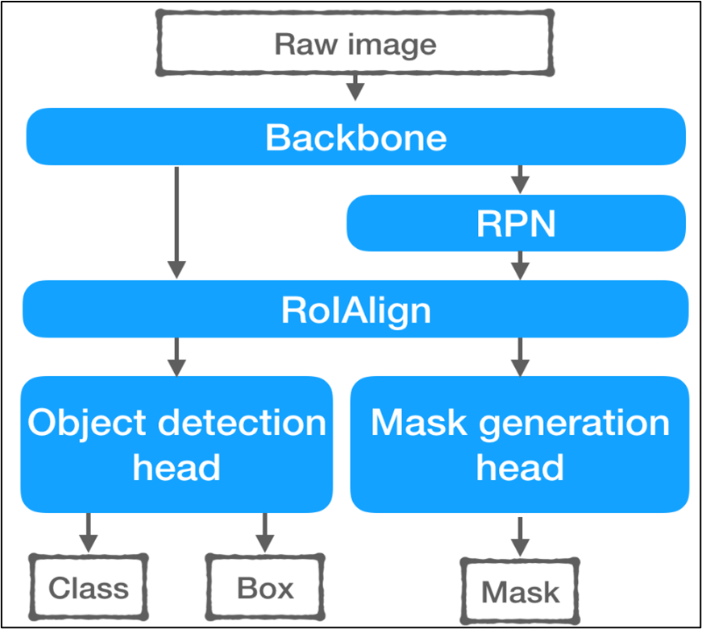
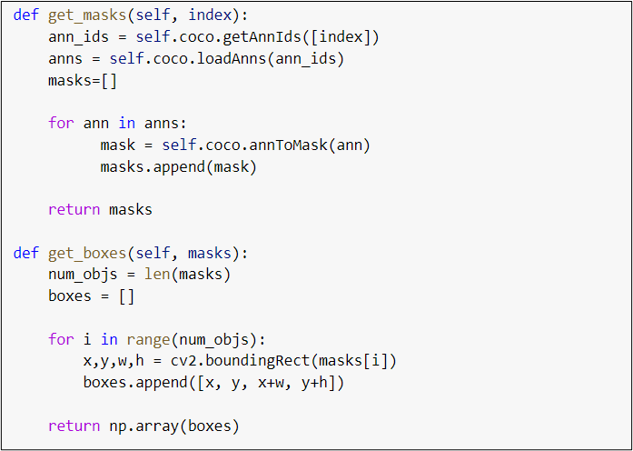

# Instance Segmentation
## Introduction:
Instance segmentation is a task that involves the identification of individual objects within an image and the allocation of each pixel to a specific object instance. When compared to semantic segmentation, which classifies pixels into categories, instance segmentation offers more specific information about the location and boundaries of each object. This is important for a variety of applications like object recognition, medical imaging, and autonomous driving.

## Methodology:
Based on the user's needs, this instance segmentation model will offer a means to extract useful information from a given image. It functions as described in the following steps:
1. To begin with, we initially upload the sample images that we have collected into a cloud platform for storage.
2. All the images are next annotated with specific labels related to the user requirements.
3. These images are trained using Mask RCNN models.
3. Finally, the output is retrieved as the masked images.

## Dataset and Data Pre-processing
The sample images for this project were collected from different locations around the University of New Haven. All these images are annotated using Label Studio by following the JSON format used in the COCO dataset. 

Once the images are annotated, we implemented transformation functions. These functions are used to convert the image into tensor format and perform resizing. It is later used to normalize functions on our input images.
Image resizing is performed as we desire the output images in the rectangular format. Here, we considered masked images in the binary format for better evaluation. We also added R, G, and B masked images trying to use different methods to get the best outputs.

### Data Pre-processing

Our project used a pre-trained model that employed Normalized and Resize Transformations. To achieve this, we incorporated the albumentation library, known for its speed and versatility in image augmentation. This powerful library facilitated various transformations, including image compression, flipping, and random image quality enhancements. It also enabled us to efficiently perform resizing and normalizing operations on our images, which had a size of 1024 x 1024 pixels. By implementing data augmentation techniques, we aimed to mitigate the risk of overfitting and minimize computational complexities during our analysis.

## Transfer Learning

Transfer learning is a machine learning method where a pre-trained model is utilized as a starting point for a new model trained on a separate but related task or dataset. The pre-trained model is utilized as a starting point rather than starting the training process from scratch, and the model's weights are adjusted on the fresh dataset. Transfer learning can result in quicker convergence, higher accuracy, and a reduction in training time and resources by using the information and representation acquired by a model that has already been trained.

####                    Model Architecture

          

## Objective Function: 
	The main objective of the MaskRCNN model is to find the class label for each instance in the image, the bounding box for the detected instance, and generate the mask for the same.
The below code reads the masks and bounding box values from the loaded json annotation files.

####                    Objective Function 

